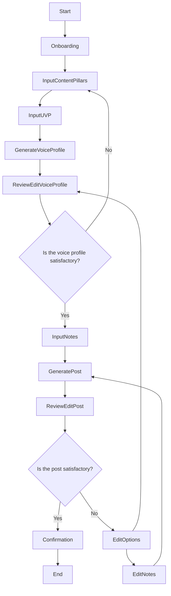

# User Flow for Creating a Voice Profile

## Introduction

This document outlines the user flow for creating a personalized voice profile and generating posts based on that profile. The goal is to provide a seamless and delightful user experience that empowers users to define their brand voice and create content effortlessly.

---

## User Flow Steps

1. **Start**

2. **Welcome and Onboarding**
   - **Description**: The user is greeted with a warm welcome screen that introduces the feature and its benefits.
   - **UX Considerations**:
     - Use engaging visuals and friendly language.
     - Provide a brief overview of the process.
     - Include a "Get Started" button to initiate the flow.

3. **Input Content Pillars**
   - **Description**: The user is prompted to input or edit their content pillars—key themes or topics that represent their brand.
   - **UX Considerations**:
     - Offer examples or suggestions to inspire the user.
     - Use an intuitive interface like draggable tags or bullet points.
     - Allow easy addition or removal of pillars.

4. **Input Unique Value Proposition (UVP)**
   - **Description**: The user inputs or edits their unique value proposition, highlighting what sets them apart.
   - **UX Considerations**:
     - Provide templates or guiding questions.
     - Use placeholder text to inspire thoughtful input.
     - Include character count indicators for conciseness.

5. **Generate Voice Profile**
   - **Description**: The system generates a voice profile based on the provided content pillars and UVP.
   - **UX Considerations**:
     - Display a progress indicator or animation.
     - Use messaging that builds anticipation (e.g., "Crafting your unique voice...").

6. **Review and Edit Voice Profile**
   - **Description**: The user reviews the generated voice profile and can make edits.
   - **UX Considerations**:
     - Highlight key elements like tone, style, and messaging guidelines.
     - Allow inline editing with instant feedback.
     - Provide tips or suggestions for optimization.

   - **Decision Point**:
     - **If Satisfied**: Proceed to input notes about the post.
     - **If Not Satisfied**: Option to revisit and edit content pillars or UVP.

7. **Input Notes About the Post**
   - **Description**: The user inputs notes or ideas for the post they want to create.
   - **UX Considerations**:
     - Use a rich text editor with formatting options.
     - Offer prompts or questions to spark creativity.
     - Allow attachment of images or files if applicable.

8. **Generate Post**
   - **Description**: The system generates a post based on the notes and the established voice profile.
   - **UX Considerations**:
     - Show a brief loading animation with encouraging messages.
     - Emphasize personalization in the messaging (e.g., "Writing your post in your unique voice...").

9. **Review and Edit Generated Post**
   - **Description**: The user reviews the generated post and can make any necessary edits.
   - **UX Considerations**:
     - Highlight how the post aligns with the voice profile.
     - Provide editing tools and track changes.
     - Offer suggestions for improvement or enhancement.

   - **Decision Point**:
     - **If Satisfied**: Proceed to confirmation and next steps.
     - **If Not Satisfied**: Option to edit the notes or revisit the voice profile.

10. **Confirmation and Next Steps**
    - **Description**: The user finalizes the post and is presented with options for what to do next.
    - **UX Considerations**:
      - Celebrate the accomplishment with positive feedback.
      - Provide options to create another post, share, schedule, or save as a draft.
      - Offer tips for maximizing the post's impact.

11. **End**

---

## Visualizing the User Flow

---

**Note**: In the flowchart above, users have the flexibility to revisit and edit previous steps if they're not satisfied with the generated content, ensuring a tailored and satisfying user experience.