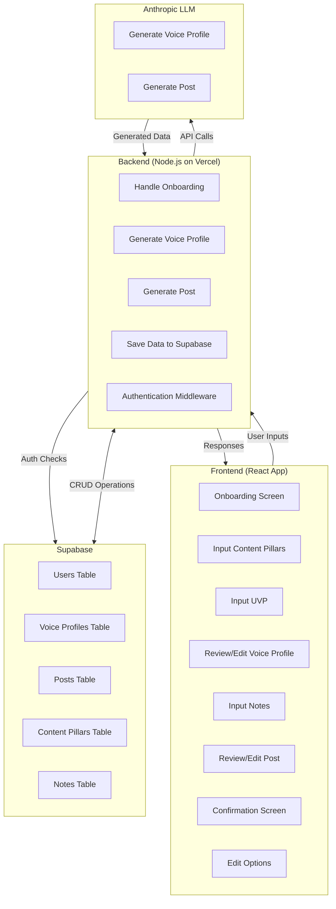
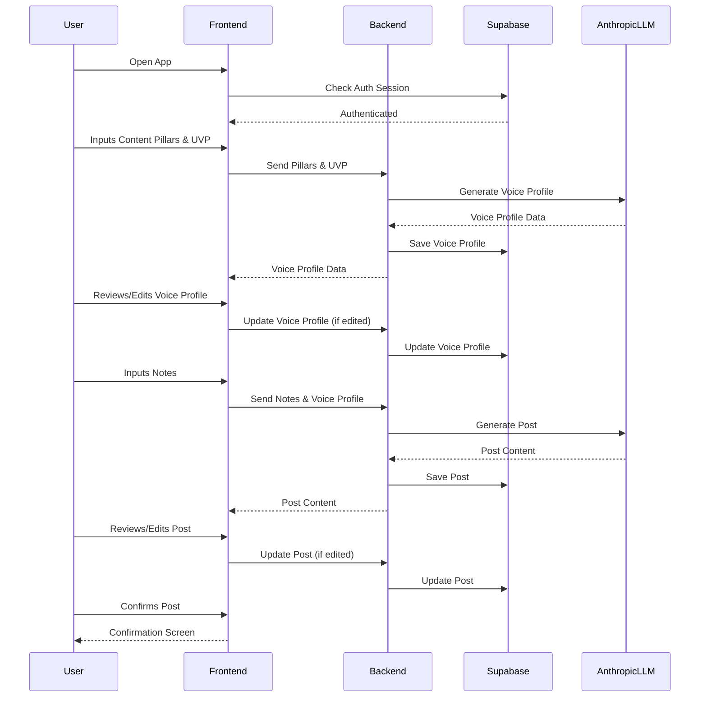

# Architectural Design for MVP Application

## Overview

This document outlines the architectural design for an MVP application that facilitates a user flow involving content creation and voice profile generation. The application leverages modern web technologies and services to ensure rapid development, scalability, and a seamless user experience.

## Technologies Used

- **Frontend**: React, Shadcn UI, Tailwind CSS
- **Backend**: Node.js (Hosted on Vercel)
- **Database**: Supabase (PostgreSQL)
- **Authentication**: Supabase SSO Auth
- **AI Services**: Anthropic LLM API
- **Deployment**: Vercel

## Architecture Components

### 1. Frontend

- **React**: For building interactive UI components.
- **Shadcn UI**: For pre-built, accessible UI components to speed up development.
- **Tailwind CSS**: For utility-first CSS styling.
- **Functionality**:
  - User Interfaces for onboarding, input forms, and content review.
  - API calls to the backend services.
  - State management for handling user inputs and session data.

### 2. Backend

- **Node.js**: Server-side logic and API endpoints.
- **Hosted on Vercel**: For serverless functions and scalable deployment.
- **Functionality**:
  - API endpoints for handling frontend requests.
  - Integration with Supabase for database operations and authentication.
  - Communication with Anthropic LLM for voice profile and content generation.

### 3. Database

- **Supabase (PostgreSQL)**:
  - Stores user data, voice profiles, content pillars, UVP (Unique Value Proposition), notes, and generated posts.
  - Real-time data listening for live updates if necessary.

### 4. Authentication

- **Supabase SSO Auth**:
  - Handles user sign-up, sign-in, and authentication flows.
  - Secures API endpoints and database access.

### 5. AI Services

- **Anthropic LLM API**:
  - Generates voice profiles based on user inputs.
  - Creates posts/content from user-provided notes and voice profiles.
  - Ensures AI-generated content aligns with user expectations.

## Data Flow Diagram

## Component Interaction Flow

1. **User Authentication**:
   - User signs up or logs in via the frontend.
   - Frontend interacts with Supabase Auth for authentication.
   - Upon successful authentication, a session is established.

2. **Onboarding Process**:
   - User navigates through onboarding screens (`UI_Onboarding`).
   - Inputs content pillars (`UI_ContentPillars`) and UVP (`UI_UVP`).

3. **Voice Profile Generation**:
   - Frontend sends content pillars and UVP to the backend (`API_VoiceProfile`).
   - Backend requests voice profile generation from Anthropic LLM (`LLM_VoiceProfile`).
   - Generated voice profile is saved in Supabase and sent to the frontend for review.

4. **Voice Profile Review**:
   - User reviews and edits the voice profile (`UI_VoiceProfile`).
   - If not satisfied, user can go back to adjust content pillars.
   - Upon satisfaction, progresses to input notes.

5. **Post Generation**:
   - User inputs notes (`UI_Notes`).
   - Frontend sends notes and voice profile to the backend (`API_PostGeneration`).
   - Backend requests post generation from Anthropic LLM (`LLM_Post`).
   - Generated post is saved and sent to the frontend for review.

6. **Post Review and Editing**:
   - User reviews and can edit the post (`UI_Post`).
   - If not satisfied, user can edit notes or revisit the voice profile.
   - Upon satisfaction, user confirms the post.

7. **Confirmation and Completion**:
   - User reaches the confirmation screen (`UI_Confirmation`).
   - All data is stored, and the process ends.

## Sequence Diagram

## Scaling Considerations

- **Frontend Scaling**:
  - Vercel efficiently handles scaling for static assets and serverless functions.
  - Code-splitting and lazy loading in React to improve performance.

- **Backend Scaling**:
  - Serverless functions scale automatically on Vercel.
  - Implement caching strategies to reduce redundant AI API calls.

- **Database Scaling**:
  - Supabase can handle scaling with increased data load.
  - Use indexing and optimized queries for performance.

- **AI Service Scaling**:
  - Ensure Anthropic LLM API plan supports the expected load.
  - Implement rate limiting and error handling for API requests.

## Security Considerations

- **Authentication & Authorization**:
  - Use Supabase's security policies to protect data.
  - Implement role-based access control if needed.

- **Data Protection**:
  - Secure user data in transit with HTTPS.
  - Encrypt sensitive data at rest in the database.

- **API Security**:
  - Protect backend endpoints with authentication middleware.
  - Validate and sanitize all inputs to prevent injection attacks.

## Conclusion

This architecture leverages modern technologies and services to build an MVP rapidly while ensuring scalability and security. By utilizing serverless functions, managed databases, and AI services, the application can handle growth and provide a seamless user experience.